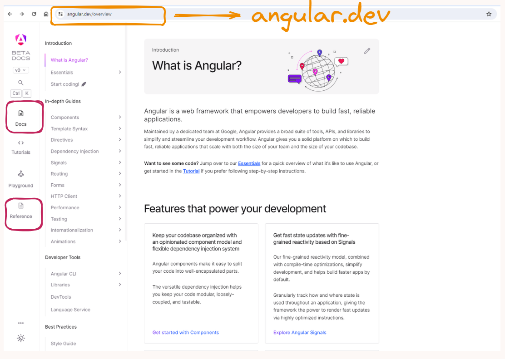

# Среща 1 - Въведение в Angular и концепцията за работни рамки
 
#### 💡 Какво разгледахме днес
- Какво е Angular и има ли почва у нас
- Сравнение на проекта с други популярни приложения на пазара
- Настройка на VSCode и популярните плъгини за него 
- Инсталация на NodeJS
- Инсталация на Angular CLI
- Създаване на първия ни Angular проект с помоща на CLI-a
- Структура на Angular проект и основни понятия
- Какво е TypeScript и как можем да го укротим
- Градивни елементи на Angular проекта

#### 🕹️ Ресурси и материали
- [Домашна работа](./hw)
- [Сорс код от срещата](./source/)

#### 🔗 Полезни линкове
- [Уроци и първи стъпки](https://angular.dev/)

<!-- #### 🔗 Полезни линкове
- [Уроци и първи стъпки](https://angular.dev/)
- [Компоненти](https://angular.io/guide/component-overview)
- [Сервизи](https://angular.io/guide/architecture-services)
- [Темплеити](https://angular.io/guide/template-overview) -->

<!-- #### 🕹️ Ресурси и материали
- [Сорс код от срещата](./source/) -->

### Какво е Angular и има ли почва у нас ? 
Angular е работна рамка, за създаване на съвременни SPA приложения. В това изречения има поне две неизвестни на които трябва да намерим отговор:
- Какво е работна рамка ?
- Какво е това SPA приложение ?

Разбира се че обожаваме, определенията ни да съдържат още повече определения, но няма как тази материя е далеч от елементарна. 

#### Какво е работна рамка ?
Когато се опитваме да решаваме даден програмен проблем, често ни се налага да прибягваме до решенията на други по знаещи и по опитни програмисти. Обикновенно ползваме същите под формата на външен код, които или е вграден в езика за програмиране, които ползваме или трябва да си го вземем от вън. Така например в езиците за програмиране, които ползваме рядко ни се налага да имплементираме методи за сортиране или механизми за изпращане на съобщения - често ги ползваме на готово. 
Обикновенно когато решаваме някакъв проблем с външен код, то казваме че ползваме библиотека или колекция от функции, които решават проблем Х. 
- Библиотека за сортиране;
- Библиотека за математически операции;
- Библиотека за визуализация на данни;
- Библиотека за криптиране на информация.
Или иначе казано строго насочен набор от функционалности, които решава клас от проблеми или един конкретен проблем. 

До тук обяснявахме библиотека, което нямаше нищо общо с първоначалния въпрос. Е не съвсем. Работна рамка е колекция от свързани библиотеки, които решават задачи свързани с моделирането на някакви процеси (workflow). Работните рамки често дефинират - набори от стъпки през които трябва да премине програмата за да реши даден проблем. В този ред на мисли Angular ни дава набор от абстракции / библиотеки с които:
- да създаваме компоненти, чрез които да визуализираме данни и HTML страници
- механизъм за управление на тези страници
- система за взимане и изпращане на данни към сървъри
- цялостен механизъм за управление на сигурност и достъп до ресурси
- и още много други.
Комбинацията от всички тези възможности ни позволява да направим архитектурно консистентно приложение, с типичен и предвидим процес.

#### Какво е SPA (Single Page Application) ? 

### Сравнение на проекта с други популярни приложения на пазара

### Инсталация на необходимия софтуер

### Да разгледаме нашия-новогенериран проект

Ще премахнем малка част от излишния код, които на този етап не ни е необходим. В този случай не ни е необходим **appConfig** - а, както и **import** израза с които го добавяме към кода.

Крайния резултат е функцията **bootstrapApplication**, която има за цел да стартира нашия основен компонент в този случай **AppComponent**. На този етап няма да ни се налага да правим никакви корекции и да го оставим да си работи. 

### Да разгледаме първия ни компонент

Основния градивен елемент на всяко едно Angular приложение, се нарича компонент. Тои представлява комбинация от:
- JavaScript / TypeScript код
- HTML темплейт
- CSS стилове
Можете да възприемем компонентите като **HTML елемент**, които можете да ползвате на произволно място във вашето приложение или като **страница**, в която да съхранявате други Angular компоненти. 

Искам да прегледаме компонента **app.component.ts**, които Angular CLI създаде за нас, защото той съдържа парченца, които ще ползваме в ежедневната си практика. 

Без паника компонентите са просто един най-обикновен TypeScript клас, който съдържа логиката за:
- визуализация на HTML елементи;
- работа със събития;
- калкулиране и трансформация на данни.

За да кажем на Angular, че класа е по специален, трябва да използваме специфичен TypeScript синтаксис наречен декоратор. Всеки декоратор започва със съмвола **@**. Angular ни предоставя и други декоратори, като имената им веднага ще ви ориентират, за какво става дума например:
- @Component - казва на Angular че класа е компонент и може да работи с HTML темплейки
- @Directive - казва на Angular че класа е директива и може да променя HTML елементи
- @Injectable - казва на Angular че класа съдържа логика, която можем да ползваме / инжектираме в компоненти

Всеки един декоратор, съдържа специфични свойства, които ще разжлеждаме в детайли. Сега ще обърнем внимание на някой от най-важните без, които няма как да да създадем валиден компонент.

#### Селектор
Angular силно промотира декларативното програмиране, тоест опитваме се да прекарваме максимално много време в HTML темплейта в опит да си свършим работата:
- пишем HTML елементи
- въртим цикли
- създаваме условни конструкции
- извикваме други Angular компоненти

За да можем да можем да разопаковаме един компонент и да го накараме да работи е необходимо да му зададем име. Това име се задава чрез свойството **selector**. 

Ако проследим как се извиква генерирания AppComponent ще видим всъщност че селектора му **app-root** се използва в рамките на **index.html** файла, заедно с офицялните HTML елементи, които ние познаваме. 

> 💡 **ДОБРИ ПРАКТИКИ**
> 
> Когато избирате название за вашия селетор, се опитайте да се придължате към следните идеи. 
> - Не включвайте думичката component в името на селектора, това е доста излишно
> - Опитайте се да вкарате достатъчно семантично значие. Какво ще прави този компонент. Може да е календар, бутон или някаква друга UI компонента
> - Добра идея е да ползваме префикси. По подразбиране Angualar ползва **app**, но вие можете да си създадете свои като например **page** или **sidebar** или **modal**

Задължително е всеки път, когато ползвате селектора на компонента, да го дефинирате с отварящ и затварящ таг, за да не се обърка системата. 

#### Линкове към външни файлове
Всеки един компонент може да дефинира в себе си линкове към външни ресурси:
- templateURL - задължително свойсто, което указва пътя към HTML темплейта. Няма как да имаме компонент без кореспондираща HTML структура. Пътя обикновенно се задава като релативен спрямо, TypeScript класа.
- styleUrl - незадължително стойвсто, което указва пътя към CSS / SCSS файла, със стиловете за този конкретен компонент. 
- styleUrls - това е версия на горното свойство, което може да укаже масив от CSS файлове, особено ако искаме да добавим външни такива за този конкретен компонент.

#### Комуникация между TypeScript и HTML 
Една от силните страни на Angular е че ни дава възможност без много много главоболия, да направим връзка между програманата логика и HTML темплейта, само с помоща на вградените в рамката инструменти.
Едно от най-елементарните връзки е тази между полетата в TypeScript класа и тяхната употреба в HTML темплета. 

Да разгледаме следния пример
Дефинираме поле **title** което има произволна стойност. Това поле може да съдържа:
- текстова информация
- някаква числова стойност
- масив от данни

Стойността на полето може да бъде директно визуализирано само с помоща на специален синтакстит **{{** ПОЛЕ / КЛАС ПРОМЕНЛИВА **}}** - известен като **интерполатор**. По този начин можем да покажем абсолютно всичко в рамките на компонента. 

### Как да работим с документацията на Angular от къде да търсим помощ ?
За добро или лошо Angular е доста солиден инструмент за разработка на приложения, което неизбежно ще ни постави в ситуация, да търсим отговор на въпроса как да решим този и този проблем. За тази цел ни е необходимо да разчитаме на някакъв информационен ресурс или документация. Нека да видим какви възможности имаме. 

#### Основна документация на проекта

Най-важния информационен ресурс е офицялната документация на Angular. Към момента тя е разпределена между два сайта:
- [angular.io](https://angular.io)
- [angular.dev](https://angular.dev)

Лично аз предпочитам втория сайт, защото той е обновена версия на основната документация и съдържа в себе си доста по структурирани, организирани и най-вече актуални ресурси не само за това как се работи с отделните абстракции на рамката, но и доста подходящи уроци, които можете да разцъкате директво в сайта, на проекта. 

#### Видеа и уроци
Някой много интересни и задълбочени уроци можете да намерите в следните канали в YouTube:
- [Decoded Frontend](https://www.youtube.com/@DecodedFrontend)
- [Monsterlessons Academy](https://www.youtube.com/@MonsterlessonsAcademy)
- [Angular University](https://www.youtube.com/@AngularUniversity)

Винаги можете да разчитате на [StackOverflow](https:://stackoverflow.com) ако ситуацията съвсем излезе извън контрол.