# Среща 1 - Въведение в Angular и концепцията за работни рамки
 
#### 💡 Какво разгледахме днес
- Какво е Angular и има ли почва у нас
- Сравнение на проекта с други популярни приложения на пазара
- Настройка на VSCode и популярните плъгини за него 
- Инсталация на NodeJS
- Инсталация на Angular CLI
- Създаване на първия ни Angular проект с помоща на CLI-a
- Структура на Angular проект и основни понятия
- Какво е TypeScript и как можем да го укротим
- Градивни елементи на Angular проекта

#### 🕹️ Ресурси и материали
- [Домашна работа](./hw)
- [Сорс код от срещата](./source/)

#### 🔗 Полезни линкове
- [Уроци и първи стъпки](https://angular.dev/)

<!-- #### 🔗 Полезни линкове
- [Уроци и първи стъпки](https://angular.dev/)
- [Компоненти](https://angular.io/guide/component-overview)
- [Сервизи](https://angular.io/guide/architecture-services)
- [Темплеити](https://angular.io/guide/template-overview) -->

<!-- #### 🕹️ Ресурси и материали
- [Сорс код от срещата](./source/) -->

### Какво е Angular и има ли почва у нас ? 
Angular е работна рамка, за създаване на съвременни SPA приложения. В това изречения има поне две неизвестни на които трябва да намерим отговор:
- Какво е работна рамка ?
- Какво е това SPA приложение ?

Разбира се че обожаваме, определенията ни да съдържат още повече определения, но няма как тази материя е далеч от елементарна. 

#### Какво е работна рамка ?
Когато се опитваме да решаваме даден програмен проблем, често ни се налага да прибягваме до решенията на други по знаещи и по опитни програмисти. Обикновенно ползваме същите под формата на външен код, които или е вграден в езика за програмиране, които ползваме или трябва да си го вземем от вън. Така например в езиците за програмиране, които ползваме рядко ни се налага да имплементираме методи за сортиране или механизми за изпращане на съобщения - често ги ползваме на готово. 
Обикновенно когато решаваме някакъв проблем с външен код, то казваме че ползваме библиотека или колекция от функции, които решават проблем Х. 
- Библиотека за сортиране;
- Библиотека за математически операции;
- Библиотека за визуализация на данни;
- Библиотека за криптиране на информация.
Или иначе казано строго насочен набор от функционалности, които решава клас от проблеми или един конкретен проблем. 

До тук обяснявахме библиотека, което нямаше нищо общо с първоначалния въпрос. Е не съвсем. Работна рамка е колекция от свързани библиотеки, които решават задачи свързани с моделирането на някакви процеси (workflow). Работните рамки често дефинират - набори от стъпки през които трябва да премине програмата за да реши даден проблем. В този ред на мисли Angular ни дава набор от абстракции / библиотеки с които:
- да създаваме компоненти, чрез които да визуализираме данни и HTML страници
- механизъм за управление на тези страници
- система за взимане и изпращане на данни към сървъри
- цялостен механизъм за управление на сигурност и достъп до ресурси
- и още много други.
Комбинацията от всички тези възможности ни позволява да направим архитектурно консистентно приложение, с типичен и предвидим процес.

#### Какво е SPA (Single Page Application) ? 

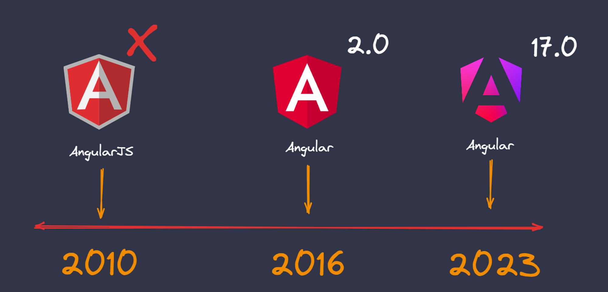

### Сравнение на проекта с други популярни приложения на пазара

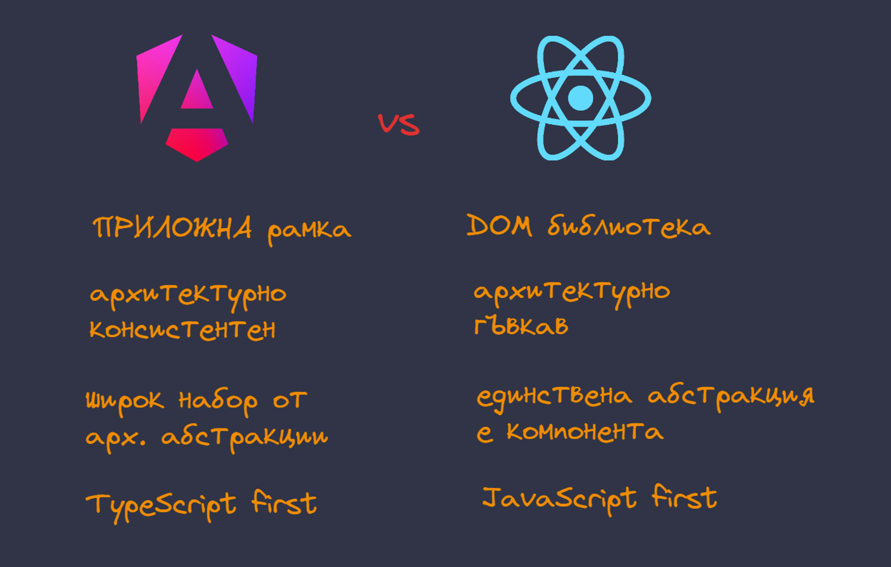

### Инсталация на необходимия софтуер

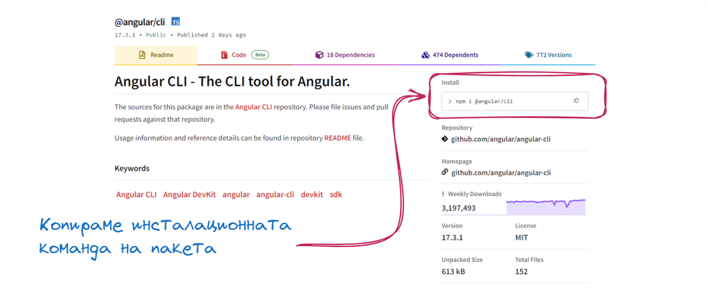

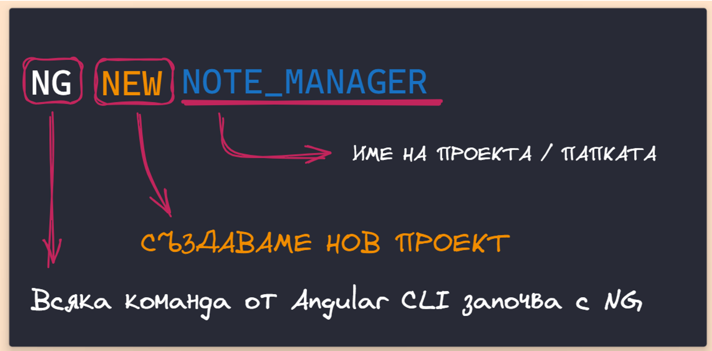

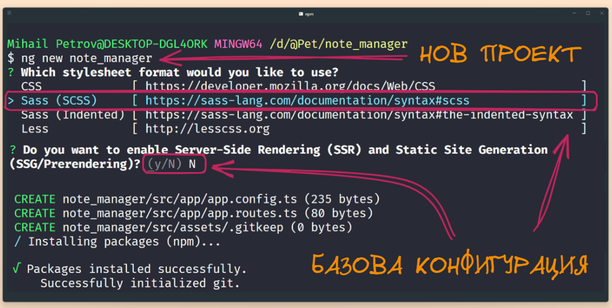

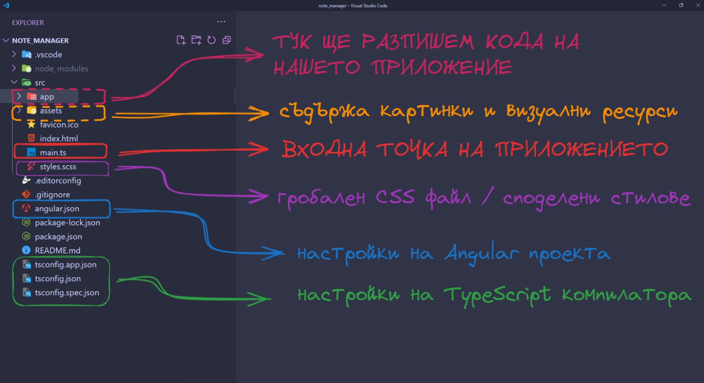

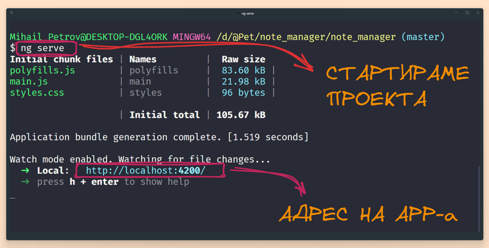

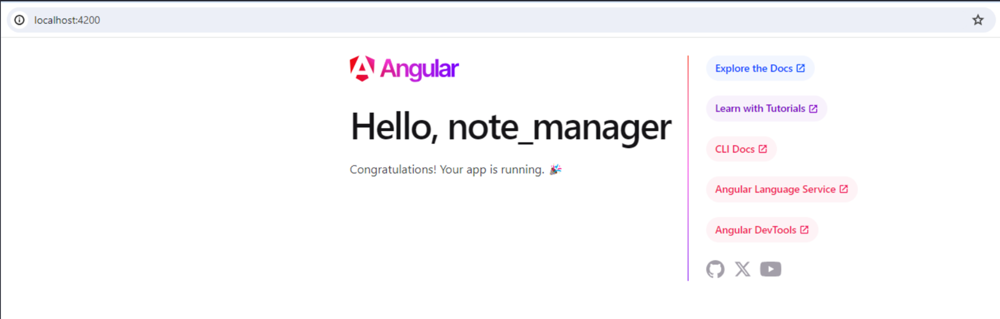

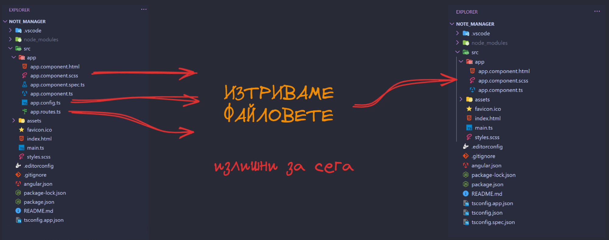

Ще премахнем малка част от излишния код, които на този етап не ни е необходим. В този случай не ни е необходим **appConfig** - а, както и **import** израза с които го добавяме към кода.

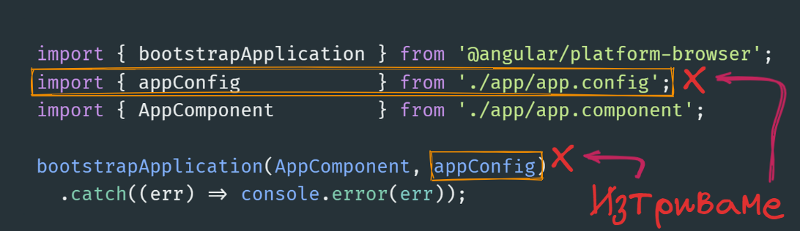

Крайния резултат е функцията **bootstrapApplication**, която има за цел да стартира нашия основен компонент в този случай **AppComponent**. На този етап няма да ни се налага да правим никакви корекции и да го оставим да си работи. 

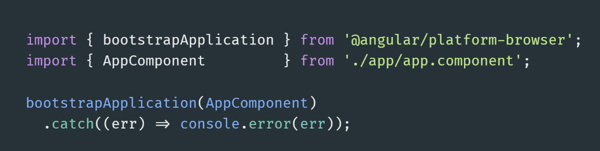

### Как да работим с документацията на Angular от къде да търсим помощ ?

### Да разгледаме първия ни компонент

Основния градивен елемент на всяко едно Angular приложение, се нарича компонент. Тои представлява комбинация от:
- JavaScript / TypeScript код
- HTML темплейт
- CSS стилове
Можете да разглеждате компонентите като HTML елемент, които можете да ползвате на произволно място във вашето приложение или като страница, в която да съхранявате други Angular компоненти. 

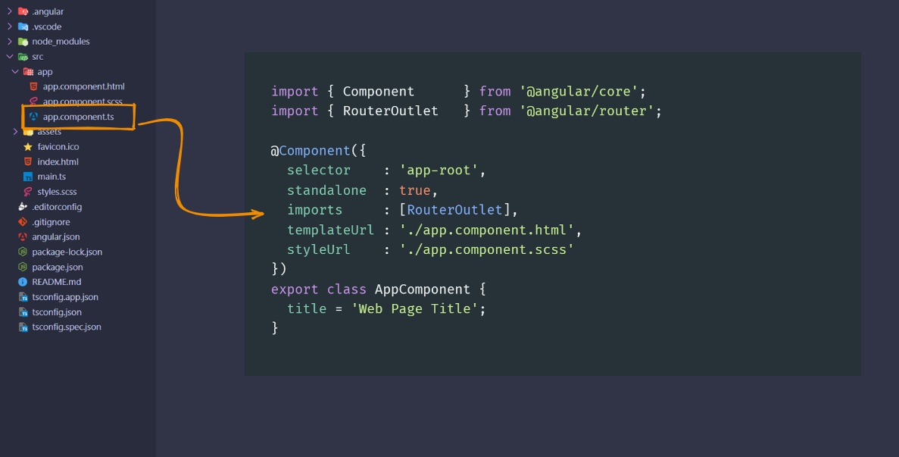

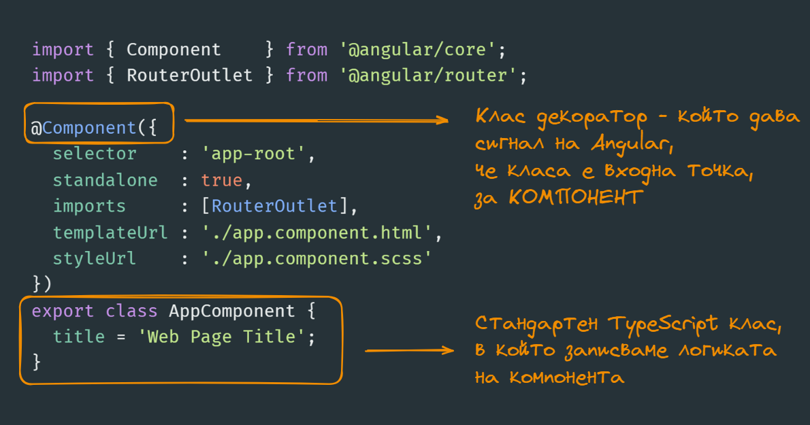

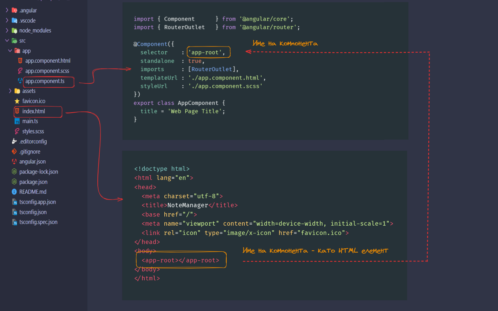

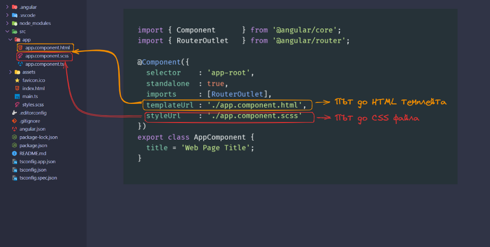

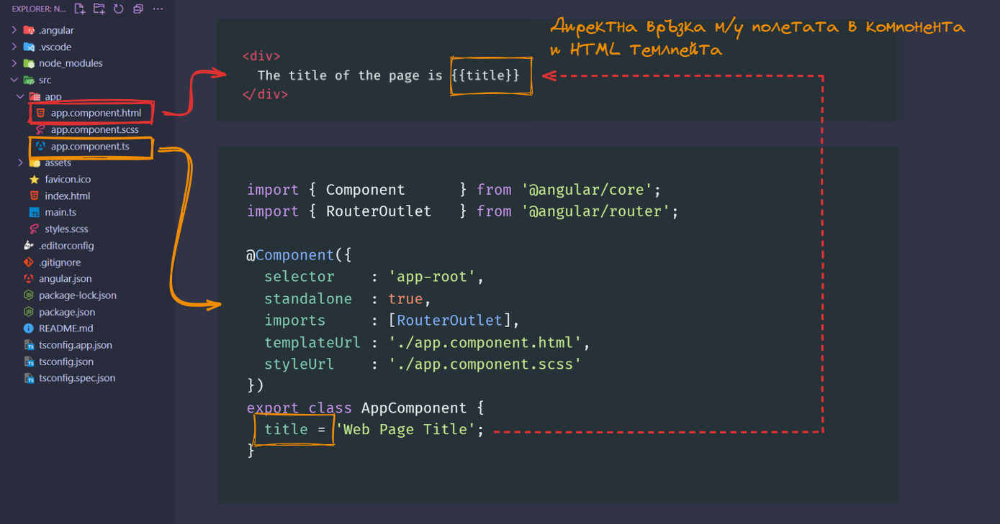