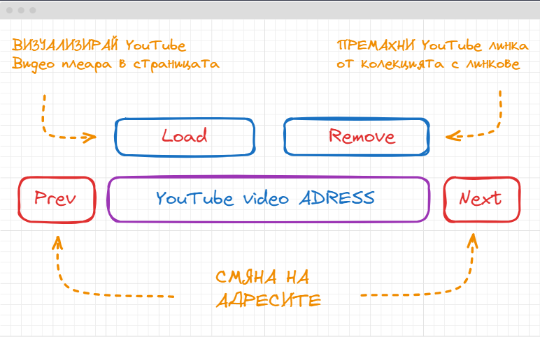
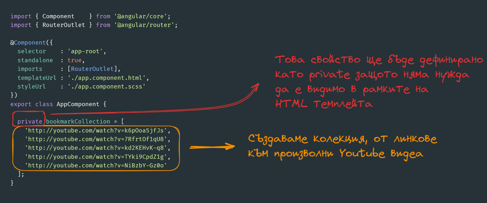
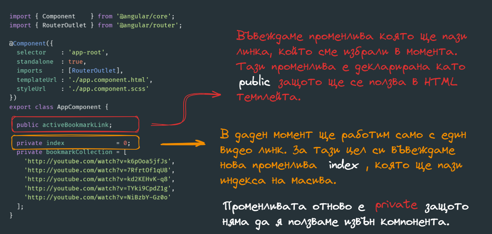
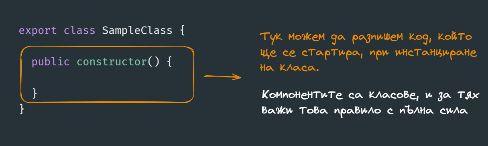
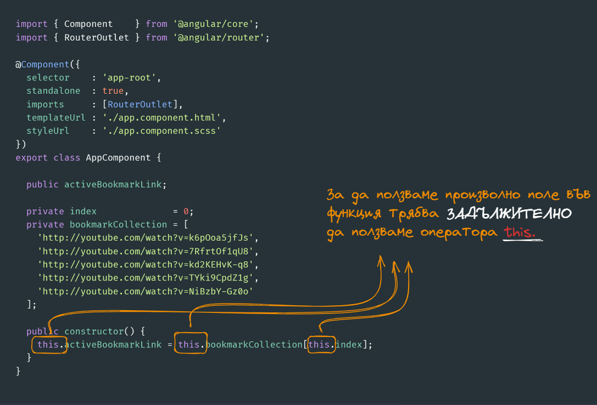
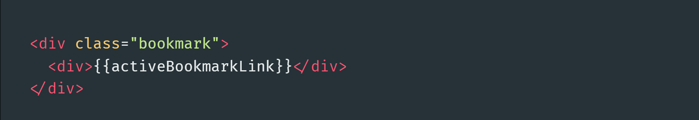

# Среща 2 - Работа с компоненти
 
#### 💡 - Какво разгледахме днес
- Създаване на иерархия от компоненти
- Входни и изходни потоци в компонентите
- Как да свържем компонента с темпейта
- Концепция и работа със структурни директиви if / switch / for

#### 🕹️ - Ресурси и материали
- [Сорс код от срещата](./source/)

# По какво ще работим днес
-- тук ще си опишем информацията по която ще работим 

# 

Ще използваме основния компонент **app.component.ts** като отправна точка в нашето приложение. Нека да изтрием всичко от темплейта **app.component.html** и да си създадем в него два бутона и един единствен **div**, в който ще визуализираме - колекцията ни от специални линкове към YouTube видеа.

> 🔥 ВАЖНО
>
> Полетата и функциите декларирани с модификатор за видимост **public** могат да се ползват в рамките на HTML
> темплейта. Всички останали модификатори за видимост, ще доведат до грешка.

Едно от нещата, които ми се иска да направим е в момента в който стартираме нашето приложение, да вземем първия линк от колекцията с видео линкове. За тази цел можем да ползваме конструктора на класа, който ще се изпълни в момента в който компонента стартира. 

Чисто синтактично конструктор в TypeScript клас се декларира, с помоща на ключовата дума **constructor**, по следния начин.

Тоест следвайки същата логика можем да въведем конструктор, в рамките на който да присвоим първия елемент от колекцията **bookmakCollection**.

Вече разгледахме как да визуализираме поле в рамките на HTML темплейта с помоща на оператора за интерпролация. Ще си направим една изключително проста HTML структура, в която да сложим полето **activeBookmarkLink**.

